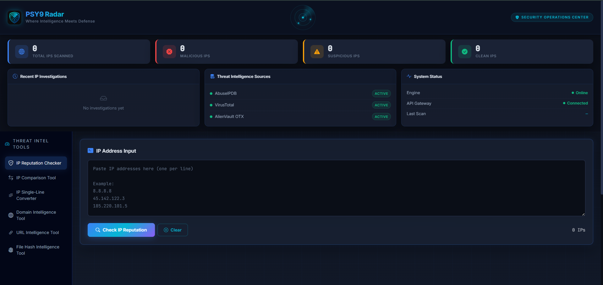

# PSY9 Radar
### Where Intelligence Meets Defense

PSY9 Radar is a **SOC-oriented Threat Intelligence Dashboard** built to help security analysts investigate and analyze large volumes of IP addresses quickly using multiple threat intelligence sources.

The platform aggregates intelligence from **AbuseIPDB, VirusTotal, and AlienVault OTX** to detect malicious activity, classify risk levels, and assist analysts in threat triage workflows.

---

## Features

- Bulk IP reputation analysis
- Multi-source threat intelligence integration
- Risk classification (Critical / High / Medium / Low)
- SOC-style investigation dashboard
- Investigation history tracking
- CSV export for analyst reports
- Fast parallel API processing
- Clean and analyst-friendly interface

---

## Threat Intelligence Sources

This tool integrates with the following threat intelligence platforms:

- AbuseIPDB
- VirusTotal
- AlienVault OTX

These services provide reputation scores, abuse reports, and contextual threat intelligence.

---

## Technology Stack

### Backend
- Python
- Flask
- AsyncIO

### Frontend
- HTML
- CSS
- JavaScript

### Threat Intelligence APIs
- AbuseIPDB API
- VirusTotal API
- AlienVault OTX API

---

## Project Structure

PSY9-RADAR
│
├── static
│ ├── style.css
│ └── script.js
│
├── templates
│ └── index.html
│
├── app.py
├── config.py
├── requirements.txt
├── .gitignore
└── README.md

---

## Installation

Clone the repository

git clone https://github.com/yagnamodi22/PSY9-RADAR.git

cd PSY9-RADAR

Create virtual environment

python -m venv .venv

Activate environment (Windows)

.venv\Scripts\activate

Install dependencies

pip install -r requirements.txt

---

## Configuration

Set your API keys using environment variables.

Example (PowerShell)

$env:ABUSEIPDB_API_KEYS="key1,key2,key3"
$env:VIRUSTOTAL_API_KEY="your_key"
$env:OTX_API_KEY="your_key"

---

## Run the Application

python app.py

Then open your browser and go to:

http://127.0.0.1:5000

---

## Dashboard Preview

### Main Dashboard

### IP Reputation Checker

)

### Threat Intelligence Results

)

---

## Use Cases

- SOC threat investigation
- Bulk IP reputation analysis
- Security research
- Incident response triage
- Threat hunting

---

## Security Note

API keys are **not stored in the repository**.  
All keys are loaded securely through **environment variables**.

---

## Future Improvements

- Threat feed integration
- IP geolocation visualization
- SIEM integration
- Advanced threat analytics
- Automated threat alerts

---

## Author

**Yagna Modi**

Cybersecurity Enthusiast  
Threat Intelligence & SOC Research

---

## License

This project is intended for educational and research purposes.